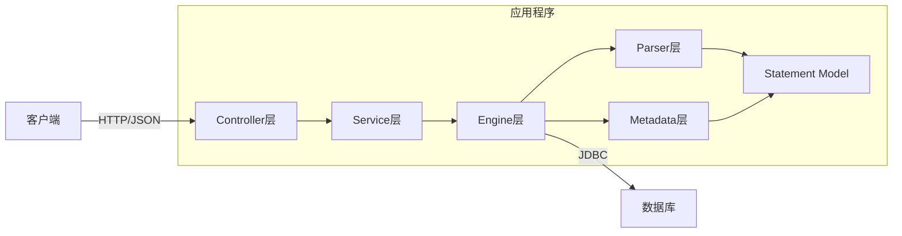
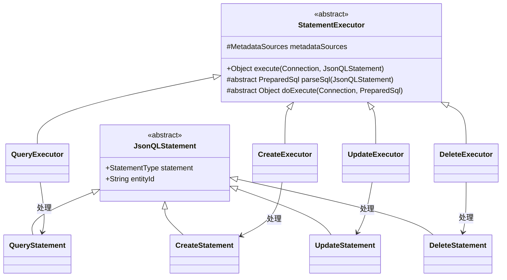
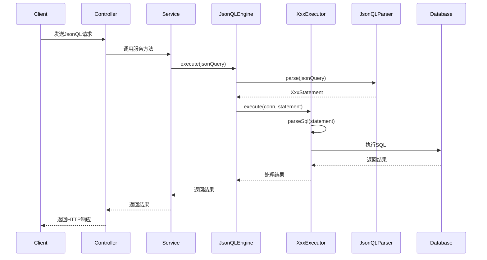

# 系统设计文档 - JsonQL

## 1. 设计理念与核心概念

JsonQL是一个基于Spring Boot的Java应用，旨在提供一种统一且灵活的方式，通过特定格式的JSON查询语言来操作关系型数据库。系统核心理念是**将CRUD操作抽象为声明式的JSON结构**，然后将这些结构转换为SQL语句执行，从而实现数据操作的标准化和简化。

### 1.1. 核心设计目标

- **统一接口**：通过标准化的JSON结构，为各种客户端应用提供一致的数据访问接口
- **类型安全**：通过明确定义的JSON结构和字段验证，减少运行时错误
- **操作抽象**：将通用的CRUD操作抽象为声明式结构，隐藏SQL复杂性
- **可扩展性**：基于抽象基类和接口，便于扩展新的操作类型和查询能力

### 1.2. 关键抽象概念

1. **Statement**：所有操作的抽象基础，包含操作类型（QUERY, CREATE, UPDATE, DELETE）
2. **Executor**：负责将Statement转换为SQL并执行，根据不同操作类型有专门的实现
3. **Clause**：SQL子句的抽象，如WHERE、JOIN、ORDER BY等
4. **Parser**：负责将JSON字符串解析为Statement对象的组件

## 2. 系统架构



**架构说明:**

*   **客户端**: 通过HTTP发送结构化的JsonQL请求。
*   **Controller层**: 接收HTTP请求，使用DTO封装请求和响应数据，调用Service层处理业务逻辑。
*   **Service层**: 实现业务逻辑，协调JsonQLEngine进行实际的数据库操作。
*   **Engine层**: 系统的核心，负责解析和执行JsonQL：
    *   基于**抽象工厂模式**设计，通过StatementExecutor接口提供统一API
    *   各种操作类型有专门的Executor实现，实现代码复用的同时支持特定逻辑
    *   使用**策略模式**处理不同类型的SQL子句（WHERE, JOIN等）
*   **Parser层**: 负责JSON到Statement对象的转换，利用类型系统确保结构正确。
*   **Statement Model**: 定义JsonQL的语法结构和组件，是系统的"语言规范"。
*   **Metadata层**: 管理数据实体的元数据，支持实体与表的映射关系。
*   **数据库**: 持久化存储数据的关系型数据库（当前配置为MySQL）。

## 3. CRUD抽象与实现

JsonQL系统通过抽象基类和专门的实现，实现了CRUD操作的共性复用和特性支持：

### 3.1. 统一抽象层



- **JsonQLStatement**：所有声明式操作的基类，包含通用属性
- **StatementExecutor**：所有执行器的基类，定义了执行流程模板方法

### 3.2. CRUD特性实现

各类操作在共享抽象的同时，也有其特定的功能和结构：

1. **查询操作 (Query)**
   - 支持条件过滤、排序、分页
   - 支持字段选择和关联查询
   - 特有组件：Filter, Sort, Page

2. **创建操作 (Create)**
   - 支持多字段同时创建
   - 支持默认值和系统字段（创建时间等）
   - 特有组件：Field 集合

3. **更新操作 (Update)**
   - 支持条件更新和主键更新
   - 支持部分字段更新
   - 特有组件：主键ID和Field集合

4. **删除操作 (Delete)**
   - 支持条件删除和主键删除
   - 支持批量删除和软删除
   - 特有组件：ID集合和Filter

### 3.3. 流程模板与钩子方法

每种操作执行器都遵循相同的模板流程，但在特定步骤有自己的实现：

1. **解析JSON** → `JsonQLParser.parse()`
2. **转换SQL** → `XxxExecutor.parseSql()`（各自实现）
3. **准备参数** → `PreparedSql`对象（包含SQL和参数）
4. **执行操作** → `XxxExecutor.doExecute()`（各自实现）
5. **处理结果** → 不同操作返回不同类型的结果

## 4. 模块详细说明

### 4.1. `engine` - 执行引擎核心

*   **`JsonQLEngine`**: 核心协调器，负责:
    - 管理各类StatementExecutor实例
    - 协调执行流程
    - 处理连接和事务

*   **`StatementExecutor` (抽象基类)**: 
    - 定义执行模板方法
    - 封装通用执行逻辑
    - 提供钩子方法供子类实现

*   **CRUD执行器**:
    *   `QueryExecutor`: 实现SELECT语句生成和结果集处理
    *   `CreateExecutor`: 实现INSERT语句生成和新增ID返回
    *   `UpdateExecutor`: 实现UPDATE语句生成和影响行计数
    *   `DeleteExecutor`: 实现DELETE语句生成和影响行计数

*   **SQL子句执行器**:
    *   `ClauseExecutor`: 子句处理的基类
    *   `WhereClauseExecutor`: 专门处理WHERE条件转换
    *   `JoinClauseExecutor`: 处理JOIN转换
    *   `OrderByClauseExecutor`: 处理排序转换
    *   `LimitClauseExecutor`: 处理分页限制

*   **`PreparedSql`**: 封装SQL和参数的数据容器，支持类型安全的参数传递

### 4.2. `statement` - 声明式结构定义

*   **`JsonQLParser`**: 
    - 使用Jackson进行JSON解析
    - 负责类型验证和对象构建
    - 处理不同操作类型分发

*   **CRUD声明类**:
    *   `QueryStatement`: 定义查询结构（条件、排序、分页）
    *   `CreateStatement`: 定义创建结构（字段集合）
    *   `UpdateStatement`: 定义更新结构（ID和字段集合）
    *   `DeleteStatement`: 定义删除结构（ID集合或条件）

*   **`JsonqlParseException`**: 自定义异常，处理解析错误

### 4.3. `statement.model` - 组件模型

*   **共用组件**:
    *   `JsonQLStatement`: 所有语句的基类
    *   `StatementType`: 枚举，定义操作类型
    *   `Condition`: 条件表达式基类

*   **筛选组件**:
    *   `Filter`: 条件容器，支持AND/OR组合
    *   `MethodType`: 支持的操作符（EQ, GT, LT, IN等）
    *   `ConditionType`: 条件类型（基本、逻辑、复合）

*   **结构组件**:
    *   `Page`: 分页定义（页码和大小）
    *   `Sort`: 排序定义（字段和方向）
    *   `Field`: 字段定义（名称和值）
    *   `Join`: 表连接定义

### 4.4. 其他关键模块
*   **`controller`**: 提供REST API接口，接收JsonQL请求。
*   **`service`**: 提供业务逻辑服务，目前是模拟实现。
*   **`model.dto`**: 定义API请求和响应的DTO。
*   **`metadata`**: 管理实体元数据，支持对象-关系映射。
*   **`config`**: 提供数据库连接管理。

## 5. CRUD操作流程

### 5.1. 统一执行流程

无论何种操作类型，都遵循以下基本流程：



### 5.2. 各操作特有处理

各类操作在遵循统一流程的基础上，有其特定的处理逻辑：

**查询 (Query)**: 
- 将Filter条件转换为WHERE子句
- 将Sort转换为ORDER BY子句
- 将Page转换为LIMIT/OFFSET子句
- 处理ResultSet映射为List<Map>

**创建 (Create)**:
- 将Field列表转换为INSERT的列和值
- 处理自增ID返回
- 构建完整的返回对象

**更新 (Update)**:
- 将Field列表转换为SET子句
- 处理WHERE条件（ID或自定义条件）
- 返回更新后的数据或影响行数

**删除 (Delete)**:
- 处理WHERE条件（ID列表或自定义条件）
- 返回影响行数

## 6. JsonQL示例与对应SQL

### 6.1. 查询操作

**JsonQL**:
```json
{
  "statement": "query",
  "entityId": "users",
  "filters": {
    "rel": "AND",
    "conditions": [
      { "field": "age", "method": "GT", "value": 18 },
      { "field": "status", "method": "IN", "values": ["active", "pending"] }
    ]
  },
  "sort": [{ "field": "createdAt", "direction": "DESC" }],
  "page": { "number": 1, "size": 10 }
}
```

**生成SQL**:
```sql
SELECT * FROM users 
WHERE age > ? AND status IN (?, ?) 
ORDER BY createdAt DESC 
LIMIT 10 OFFSET 0
```

### 6.2. 创建操作

**JsonQL**:
```json
{
  "statement": "create",
  "entityId": "users",
  "fields": [
    { "field": "name", "value": "张三" },
    { "field": "age", "value": 25 },
    { "field": "status", "value": "active" }
  ]
}
```

**生成SQL**:
```sql
INSERT INTO users (name, age, status, created_at, updated_at) 
VALUES (?, ?, ?, ?, ?)
```

### 6.3. 更新操作

**JsonQL**:
```json
{
  "statement": "update",
  "entityId": "users",
  "dataId": "123",
  "fields": [
    { "field": "age", "value": 26 },
    { "field": "status", "value": "inactive" }
  ]
}
```

**生成SQL**:
```sql
UPDATE users 
SET age = ?, status = ?, updated_at = ? 
WHERE id = ?
```

### 6.4. 删除操作

**JsonQL**:
```json
{
  "statement": "delete",
  "entityId": "users",
  "ids": ["123", "456", "789"]
}
```

**生成SQL**:
```sql
DELETE FROM users 
WHERE id IN (?, ?, ?)
```

## 7. 未来优化与发展方向

*   **`DataServiceImpl` 实际对接**: 将模拟实现替换为实际调用JsonQLEngine的逻辑。
*   **复杂查询增强**:
    * 支持更复杂的JOIN操作和子查询
    * 增加聚合函数支持
    * 支持复杂的分组操作
*   **SQL优化**: 通过动态分析和优化器提升性能。
*   **批量操作**: 优化批量创建、更新和删除的性能。
*   **事务支持**: 增强事务管理功能，支持多操作事务。
*   **ORM增强**: 完善对象-关系映射，支持实体类型自动映射。
*   **安全增强**: 
    * 字段级别权限控制
    * 数据行级过滤
    * 更严格的输入验证
*   **元数据驱动**: 从元数据自动生成操作约束和验证规则。
*   **全面测试**: 添加单元测试和集成测试，确保各模块功能正确和系统整体稳定性。