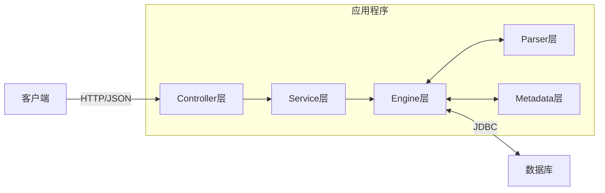
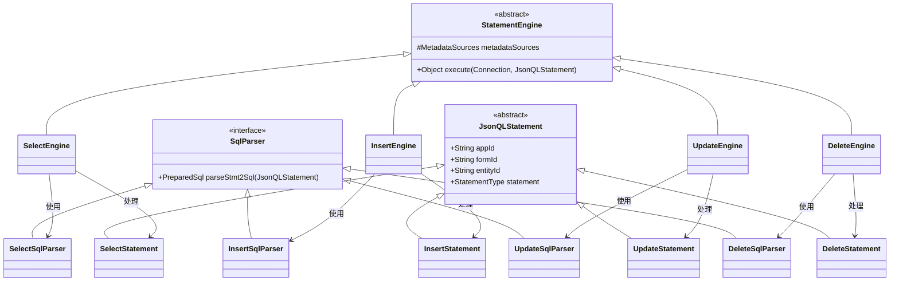
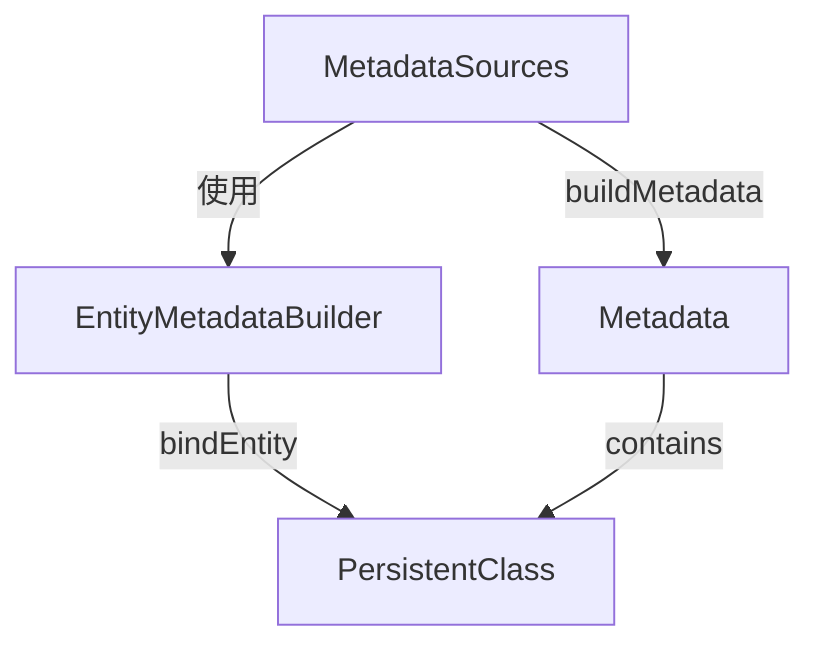
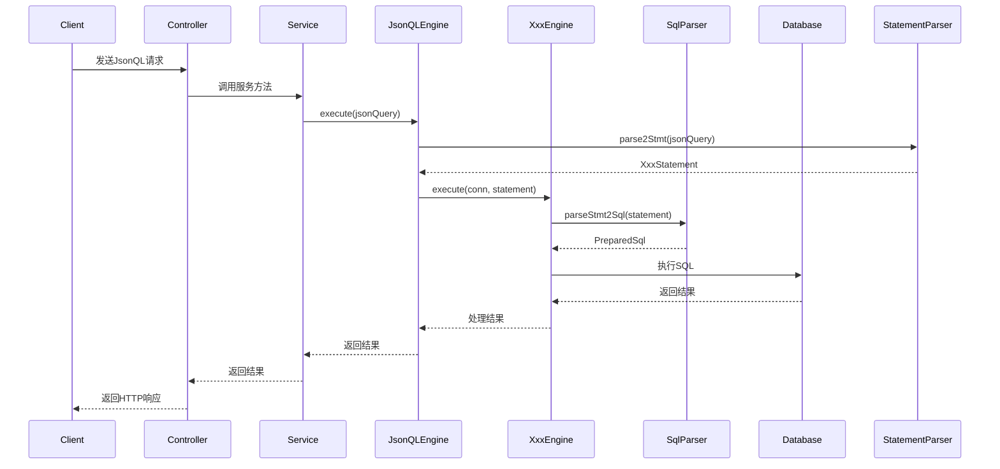
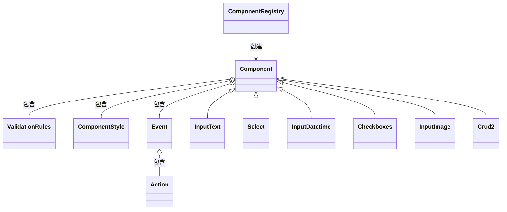
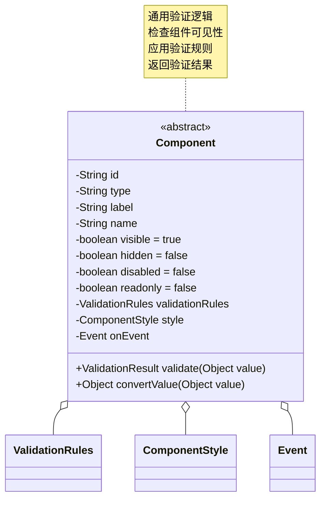
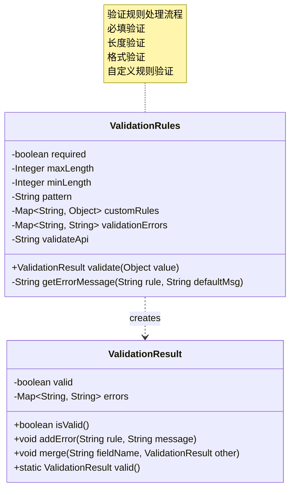
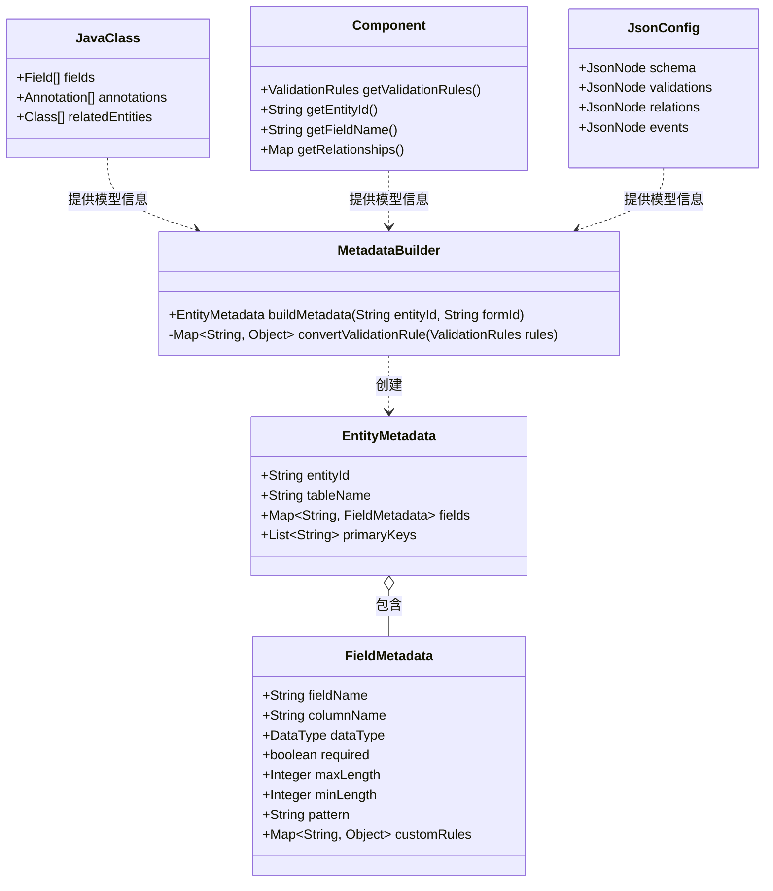
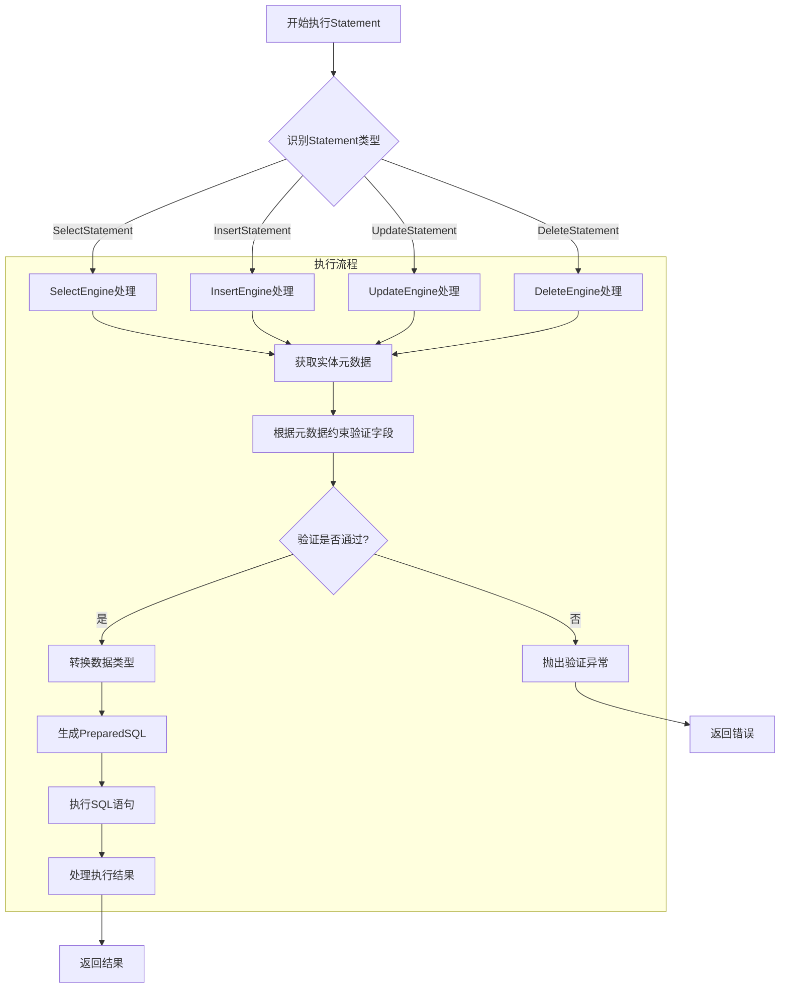

# 系统设计文档 - Engine

- [ ] sql cache

## 设计理念与核心概念

Engine 旨在提供一种统一且灵活的方式，通过特定格式的 JSON 查询语言来操作关系型数据库。系统核心理念是**将 CRUD 操作抽象为声明式的 JSON 结构**，然后将这些结构转换为 SQL 语句执行，从而实现数据操作的标准化和简化。

### 核心设计目标

- **统一接口**：通过标准化的 JSON 结构，为各种客户端应用提供一致的数据访问接口
- **类型安全**：通过明确定义的 JSON 结构和字段验证，减少运行时错误
- **操作抽象**：将通用的 CRUD 操作抽象为声明式结构，隐藏 SQL 复杂性
- **可扩展性**：基于抽象基类和接口，便于扩展新的操作类型和查询能力

### 关键抽象概念

- **Statement**：所有操作的抽象基础，包含操作类型（QUERY, CREATE, UPDATE, DELETE）
- **Engine**：负责将 Statement 转换为 SQL 并执行，根据不同操作类型有专门的实现
- **Clause**：SQL 子句的抽象，如 WHERE、JOIN、ORDER BY 等
- **Parser**：负责将 JSON 字符串解析为 Statement 对象的组件

## 系统架构

**架构说明:**

- **客户端**: 通过 HTTP 发送结构化的 JsonQL 请求。
- **Controller 层**: 接收 HTTP 请求，使用 DTO 封装请求和响应数据，调用 Service 层处理业务逻辑。
- **Service 层**: 实现业务逻辑，协调 JsonQLEngine 进行实际的数据库操作。
- **Engine 层**: 系统的核心，负责解析和执行 JsonQL：
  - 基于**策略模式**设计，通过 StatementEngine 接口提供统一 API
  - 各种操作类型有专门的 Engine 实现，实现代码复用的同时支持特定逻辑
  - 使用专门的 SqlParser 处理 SQL 转换
  - 使用**策略模式**处理不同类型的 SQL 子句（WHERE, JOIN 等）
- **Parser 层**: 负责 JSON 到 Statement 对象的转换，利用类型系统确保结构正确。
- **Statement Model**: 定义 JsonQL 的语法结构和组件，是系统的"语言规范"。
- **Metadata 层**: 管理数据实体的元数据，支持实体与表的映射关系。
- **数据库**: 持久化存储数据的关系型数据库（当前配置为 MySQL）。

## CRUD 抽象与实现

JsonQL 系统通过抽象基类和专门的实现，实现了 CRUD 操作的共性复用和特性支持：

### 统一抽象层

- **JsonQLStatement**：所有声明式操作的基类，包含通用属性
- **StatementEngine**：所有执行器的基类，定义了执行流程
- **SqlParser**：SQL 转换接口，负责将 Statement 转换为 PreparedSql

### CRUD 特性实现

各类操作在共享抽象的同时，也有其特定的功能和结构：

- **查询操作 (Query)**

  - 支持条件过滤、排序、分页
  - 支持字段选择和关联查询
  - 特有组件：Filter, Sort, Page

- **创建操作 (Create)**

  - 支持多字段同时创建
  - 支持默认值和系统字段（创建时间等）
  - 特有组件：Field 集合

- **更新操作 (Update)**

  - 支持条件更新和主键更新
  - 支持部分字段更新
  - 特有组件：主键 ID 和 Field 集合

- **删除操作 (Delete)**
  - 支持条件删除和主键删除
  - 支持批量删除和软删除
  - 特有组件：ID 集合和 Filter

## 模块详细说明

### `engine` - 执行引擎核心

- **`JsonQLEngine`**: 核心协调器，负责:

  - 管理各类 StatementEngine 实例
  - 协调执行流程
  - 处理连接和事务

- **`StatementEngine` (抽象基类)**:

  - 定义执行方法
  - 封装通用执行逻辑

- **CRUD 执行引擎**:

  - `SelectEngine`: 实现 SELECT 语句执行和结果集处理
  - `InsertEngine`: 实现 INSERT 语句执行和新增 ID 返回
  - `UpdateEngine`: 实现 UPDATE 语句执行和影响行计数
  - `DeleteEngine`: 实现 DELETE 语句执行和影响行计数

- **SQL 解析组件**:

  - `SqlParser`: SQL 解析接口
  - `PreparedSql`: 封装 SQL 和参数的数据容器，支持类型安全的参数传递
  - `WhereClauseSqlParser`: 处理 WHERE 条件转换
  - `JoinClauseSqlParser`: 处理 JOIN 转换
  - `OrderByClauseSqlParser`: 处理排序转换
  - `LimitClauseSqlParser`: 处理分页限制

### `statement` - 声明式结构定义

- **`StatementParser`**:

  - 使用 Jackson 进行 JSON 解析
  - 负责类型验证和对象构建
  - 处理不同操作类型分发

- **CRUD 声明类**:

  - `SelectStatement`: 定义查询结构（条件、排序、分页）
  - `InsertStatement`: 定义创建结构（字段集合）
  - `UpdateStatement`: 定义更新结构（ID 和字段集合）
  - `DeleteStatement`: 定义删除结构（ID 集合或条件）

### `metadata` - 结构定义

## CRUD 操作流程

### 统一执行流程

无论何种操作类型，都遵循以下基本流程：

### 各操作特有处理

各类操作在遵循统一流程的基础上，有其特定的处理逻辑：

- **查询 (Query)**:
  - 将 Filter 条件转换为 WHERE 子句
  - 将 Sort 转换为 ORDER BY 子句
  - 将 Page 转换为 LIMIT/OFFSET 子句
  - 处理 ResultSet 映射为 List<Map>
  - 支持关联字段处理（处理格式: relation_field）
- **创建 (Create)**:
  - 将 Field 列表转换为 INSERT 的列和值
  - 处理自增 ID 返回
  - 构建完整的返回对象
- **更新 (Update)**:
  - 将 Field 列表转换为 SET 子句
  - 处理 WHERE 条件（ID 或自定义条件）
  - 返回更新后的数据或影响行数
- **删除 (Delete)**:
  - 处理 WHERE 条件（ID 列表或自定义条件）
  - 返回影响行数

## 组件

为了将 UI 配置的 JSON 有效地转换为 Java 对象，并在 JsonQL 处理过程中应用相应的校验和限制，我们设计了一套组件模型系统。该系统使得前端 UI 配置能够直接映射到后端验证逻辑，确保数据完整性和业务规则的一致性。

### 组件模型架构

### 组件与 JsonQL 集成

组件设计的核心目标是将 UI 配置与数据处理逻辑紧密结合，具体实现方式如下：

1. **组件注册与解析**：

   - 通过`ComponentRegistry`统一管理所有 UI 组件类型
   - 提供 JSON 到 Java 对象的转换能力
   - 支持组件嵌套和复合组件的处理

2. **验证规则映射**：

   - 组件的验证规则直接映射到 JsonQL 处理流程
   - 在数据写入或查询前进行规则验证
   - 支持同步验证和异步验证（通过 API）

3. **数据转换与类型处理**：
   - 根据组件类型自动处理数据类型转换
   - 特殊格式（如日期格式）的标准化处理
   - 处理数组与对象的序列化与反序列化

### 组件类型与校验规则

#### 基础组件

每个组件都继承自抽象的`Component`类，包含通用属性和行为：

#### 验证规则处理

验证规则类封装了各种验证逻辑，与 JsonQL 处理紧密集成：

### 元数据构建与验证规则转换

组件定义的验证规则在元数据构建阶段被提取并转换为统一的约束格式：

这种设计将组件验证规则转换为元数据约束的过程在以下几个方面优化了系统：

1. **性能优化**：验证规则仅在元数据加载时处理一次，而不是每次执行时重新解析
2. **关注点分离**：组件负责定义验证规则，而引擎负责应用这些规则
3. **缓存机制**：转换后的元数据可以被缓存，减少重复解析的开销
4. **统一验证**：无论验证规则来自哪种组件，都被转换为统一的约束格式

### StatementEngine 实现

引擎使用转换后的元数据约束进行数据验证：

每种 StatementEngine 虽然处理不同类型的操作，但都遵循相同的执行流程：

1. **获取实体元数据**：从 MetadataSources 中加载实体结构和约束信息
2. **验证字段**：根据元数据中的约束规则验证输入字段
3. **类型转换**：将输入数据转换为适当的数据类型
4. **SQL 生成**：生成对应操作的 SQL 语句
5. **执行与处理**：执行 SQL 并处理结果

验证过程是在 SQL 生成前进行的，确保了只有合法的数据才会被发送到数据库执行。

## 未来优化与发展方向

- **复杂查询增强**:
  - 支持更复杂的 JOIN 操作和子查询
  - 增加聚合函数支持
  - 支持复杂的分组操作
- **SQL 优化**: 通过动态分析和优化器提升性能。
- **批量操作**: 优化批量创建、更新和删除的性能。
- **事务支持**: 增强事务管理功能，支持多操作事务。
- **ORM 增强**: 完善对象-关系映射，支持实体类型自动映射。
- **安全增强**:
  - 字段级别权限控制
  - 数据行级过滤
  - 更严格的输入验证
- **元数据驱动**: 从元数据自动生成操作约束和验证规则。
- **全面测试**: 添加单元测试和集成测试，确保各模块功能正确和系统整体稳定性。
